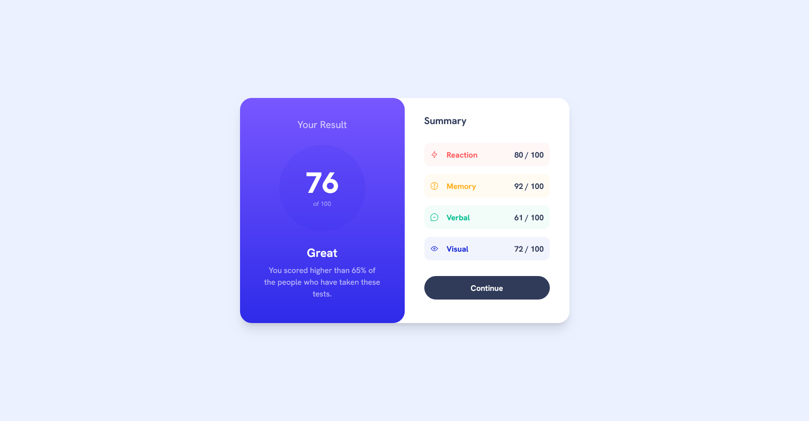
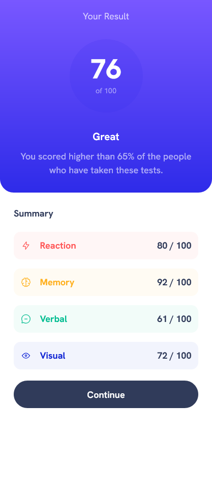

# Frontend Mentor - Results summary component solution

This is a solution to the [Results summary component challenge on Frontend Mentor](https://www.frontendmentor.io/challenges/results-summary-component-CE_K6s0maV). Frontend Mentor challenges help you improve your coding skills by building realistic projects.

## Table of contents

- [Overview](#overview)
  - [The challenge](#the-challenge)
  - [Screenshot](#screenshot)
  - [Links](#links)
- [My process](#my-process)
  - [Built with](#built-with)
  - [What I learned](#what-i-learned)
- [Author](#author)

## Overview

### The challenge

Users should be able to:

- View the optimal layout for the interface depending on their device's screen size
- See hover and focus states for all interactive elements on the page
- **Bonus**: Use the local JSON data to dynamically populate the content

### Screenshot

#### Desktop Design

#### Mobile Design

### Links

- Solution URL: [https://github.com/Akiz-Ivanov/result-summary-component](https://github.com/Akiz-Ivanov/result-summary-component)
- Live Site URL: [https://akiz-ivanov.github.io/result-summary-component/](https://akiz-ivanov.github.io/result-summary-component/)

## My process

### Built with

- **React** – for component-based architecture
- **Tailwind CSS** – for utility-first styling
- **Flexbox & Grid** – for layout and responsive structure
- **Mobile-first workflow**

### What I learned

I focused on responsive layout and consistent spacing with Tailwind’s utility classes. It was a good chance to experiment with custom theme values, color layering using `hsla()`, and component reusability in React. Tailwind 4.0’s new `@theme` feature also allowed me to centralize design tokens.

## Author

- Frontend Mentor - [@Akiz97](https://www.frontendmentor.io/profile/Akiz97)